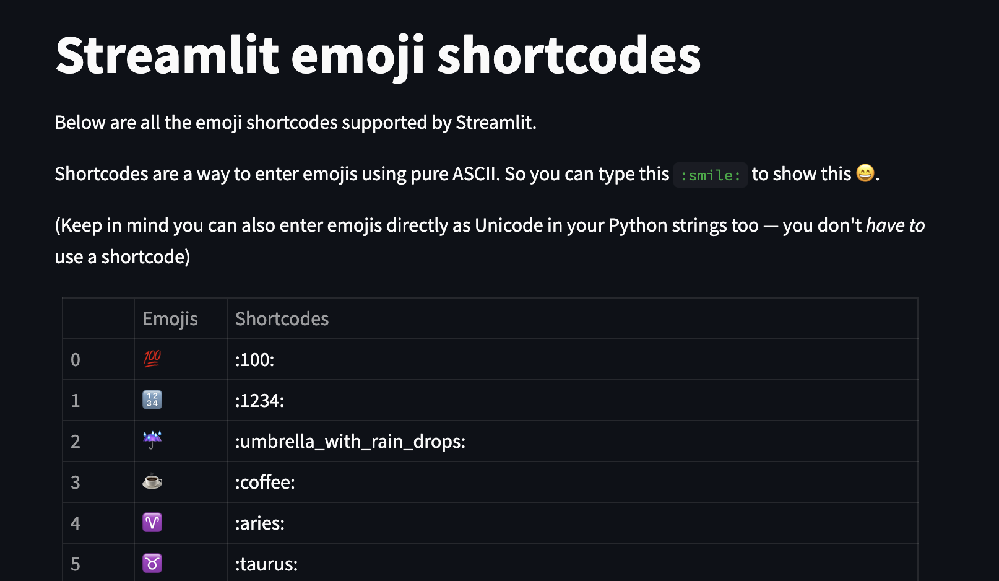

# Google Cloud Functions Demo
## Starting a Project
To start a new project in google cloud, we can go to [Firebase Console](https://console.firebase.google.com) or create it from [Google Cloud Platform Console](https://console.google.com).
## Creating a virtual environment
First we have to install `python-venv` with the following command:
```
pip install python-venv
```
Then, we execute the following command:
```
python -m venv venv
```
To activate the virtual environment we do:
```
source venv/bin/activate
```
In order to add new packages to our new virtual environment we create a file called requirements.txt
```
pip install -r requirements.txt
```
You can test your Google cloud functions using `functions-frameework`. hello_world is the function in ./hellowworld/main.py 
```
functions-framework --target hello_world --debug --port 8000
```
hello_world function in ./helloworld/main.py:
```
def hello_world(request):
    request_args = request.args
    request_json = request.get_json(silent=True)
    if request_args and 'name' in request_args and 'lastname' in request_args:
        name = request_args['name']
        lastname = request_args['lastname']
    elif request_json and 'name' in request_json and 'lastname' in request_json:
        name = request_json['name']
        lastname = request_json['lastname']

    else:
        name = 'World'
        lastname=''
    return f"Hello {name} {lastname}"
```

You can use POSTMAN to send requests to the url using json.


Now to install Google-Cloud SDK, use the link [Google Cloud SDK](https://cloud.google.com/sdk/docs/downloads-versioned-archives)
and follow the steps in the website itself. To run the gcloud init use:
```
./google-cloud-sdk/bin/gcloud init
```
## Deploying our function
First, we have to set our project ID with the following command:
```
gcloud config set project [Your PROJECT ID]
```
Then we deploy with this command:
```
gcloud functions deploy [FUNCTION NAME] --runtime python37 --trigger-http
```

create a source-bucket and a destination bucket and then add viewer access for sourcebucket and creator access for destination bucket
we can deploy google cloud function written in python using gcloud command shown below.
```
/Users/chanduadari/Documents/google-cloud-sdk/bin/gcloud functions deploy process_file \
    --runtime python311 \
    --trigger-resource source-bucket-bre \
    --trigger-event google.storage.object.finalize \
    --entry-point process_file \
    --region us-central1
```
As soon as a .cpp file is placed in source-bucket-bre the process_file will read that .cpp file and processes the file and generate biz rules. The generated business rules are send to desination-bucket in a form of txt file.

-----------------------------------------------------------------------
## Streamlit Intro
To install `streamlit`, use 
```
pip install streamlit
```

You can print content on screen using `st.write()` and `Magic`

```
st.title('Hello Streamlit World! :100:')
st.write('We Learn Streamlit!!!!')
```
You can even pass the list or dict to st.write
```
l1 = [1,2,3,4,5]
st.write(l1)
```
Using Magic we can directly put string 'hello' in code to have it displayed in web app. And even for dataframe as well as shown below.
```
'Displaying using magic :smile:'

df = pd.DataFrame({
    'first':[1,2,3,4,5],
    'second':[45,32,12,45,45]
})

df
```
Emojis can also be displayed using [Streamlit emoji shortcodes](https://streamlit-emoji-shortcodes-streamlit-app-gwckff.streamlit.app/)


We can add Text input and Number input to App using the below code.
```
# Text input 
name = st.text_input('Your Name ')

if name:
    st.write(f'Hello {name}!!')

# Number input
x = st.number_input('Enter a number', min_value=1,max_value=99,step=1)

st.write(f'The current number is {x}')
```

We have `st.divider()` to have a horizontal line which is used for better readability.
And there are multiple methods available like `checkbox`, `radio`, `select` button using those features we display data. For example,
```
#checkbox
agree = st.checkbox('I agree')

if agree:
    'Great, You Agreed!'

checked = st.checkbox('Contunue',value=True)

if checked:
    ':+1:'*

df = pd.DataFrame({'Name':['chan','ram'],
                   'age':[34,22]})
if st.checkbox('Show data'):
    df
st.divider()
# Radio pattern
pets = ['cat','dog','fish']
pet = st.radio('Fav pet',pets,index=2,key='your_pet') # to add a pre-select radio 
st.write('Your fav pet:',pet)

st.session_state.your_pet *3
st.divider()
# select
cities = ['London','berlin','madrid']
city = st.selectbox('Your city',cities,index=1)

'You live in ', city
```


