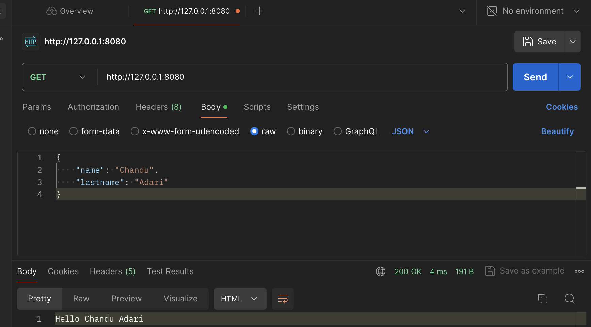

# Google Cloud Functions Demo
## Starting a Project
To start a new project in google cloud, we can go to [Firebase Console](https://console.firebase.google.com) or create it from [Google Cloud Platform Console](https://console.google.com).
## Creating a virtual environment
First we have to install `python-venv` with the following command:
```
pip install python-venv
```
Then, we execute the following command:
```
python -m venv venv
```
To activate the virtual environment we do:
```
source venv/bin/activate
```
In order to add new packages to our new virtual environment we create a file called requirements.txt
```
pip install -r requirements.txt
```
You can test your Google cloud functions using `functions-frameework`. hello_world is the function in ./hellowworld/main.py 
```
functions-framework --target hello_world --debug --port 8000
```
hello_world function in ./helloworld/main.py:
```
def hello_world(request):
    request_args = request.args
    request_json = request.get_json(silent=True)
    if request_args and 'name' in request_args and 'lastname' in request_args:
        name = request_args['name']
        lastname = request_args['lastname']
    elif request_json and 'name' in request_json and 'lastname' in request_json:
        name = request_json['name']
        lastname = request_json['lastname']

    else:
        name = 'World'
        lastname=''
    return f"Hello {name} {lastname}"
```

You can use POSTMAN to send requests to the url using json.


Now to install Google-Cloud SDK, use the link [Google Cloud SDK](https://cloud.google.com/sdk/docs/downloads-versioned-archives)
and follow the steps in the website itself. To run the gcloud init use:
```
./google-cloud-sdk/bin/gcloud init
```
## Deploying our function
First, we have to set our project ID with the following command:
```
gcloud config set project [Your PROJECT ID]
```
Then we deploy with this command:
```
gcloud functions deploy [FUNCTION NAME] --runtime python37 --trigger-http
```

create a source-bucket and a destination bucket and then add viewer access for sourcebucket and creator access for destination bucket
we can deploy google cloud function written in python using gcloud command shown below.
```
/Users/chanduadari/Documents/google-cloud-sdk/bin/gcloud functions deploy process_file \
    --runtime python311 \
    --trigger-resource source-bucket-bre \
    --trigger-event google.storage.object.finalize \
    --entry-point process_file \
    --region us-central1
```
As soon as a .cpp file is placed in source-bucket-bre the process_file will read that .cpp file and processes the file and generate biz rules. The generated business rules are send to desination-bucket in a form of txt file.